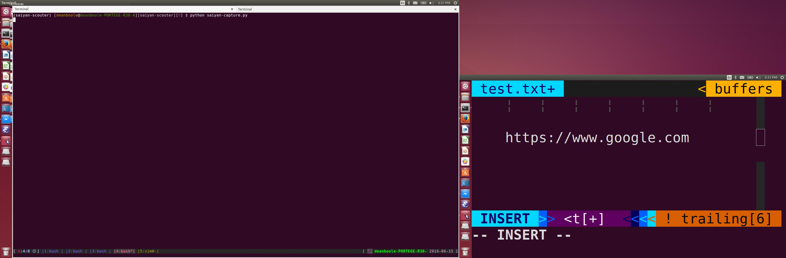

## Saiyan Scouter - 賽亞人次侯
Like saiyan, you could use this scouter to detect, analyze objects you see.

### How Saiyan Scouter works?

1.  Take a screenshot of Desktop.
2.  Save the screenshot as a jpg file.
3.  Extract text from jpg file.
4.  Analyze text that matches specific patterns.

### Show Case

* Screenshot of Desktop, our goal is to let Saiyan Scouter found analyze the url.

* Saiyan did found the url and show the url title.

### Caution
This project is still on early stage. The text extacted varies often.
Roughly estamated, the successful rate is 0.1.
